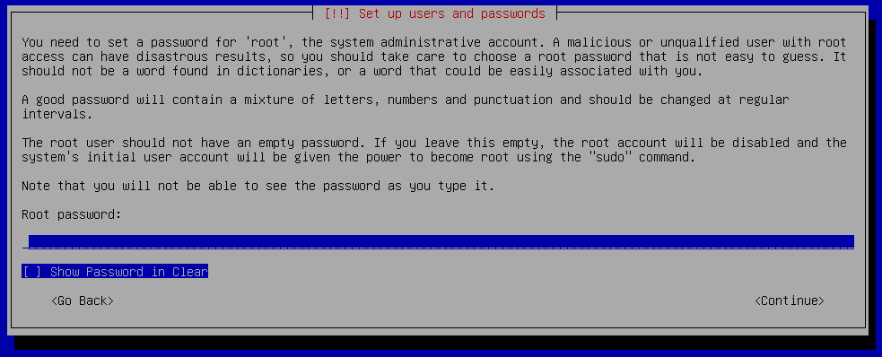
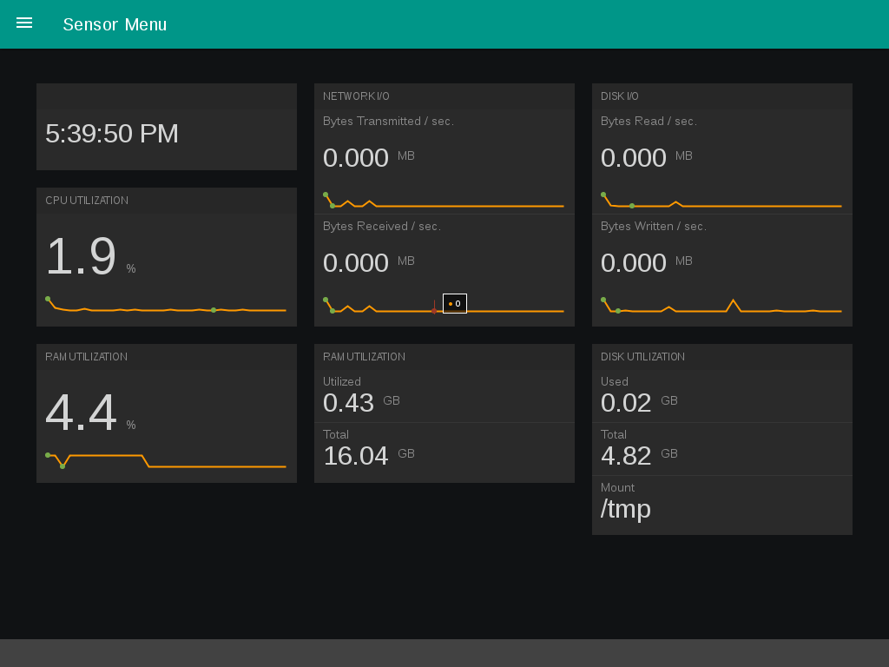
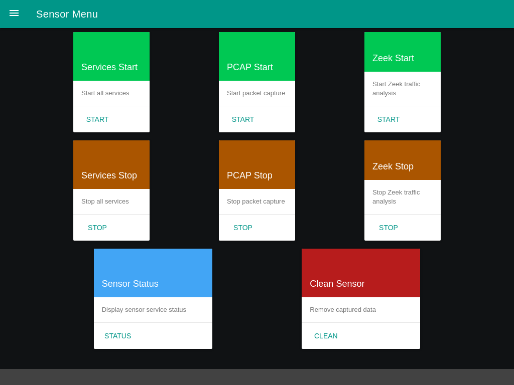
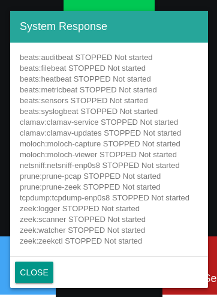
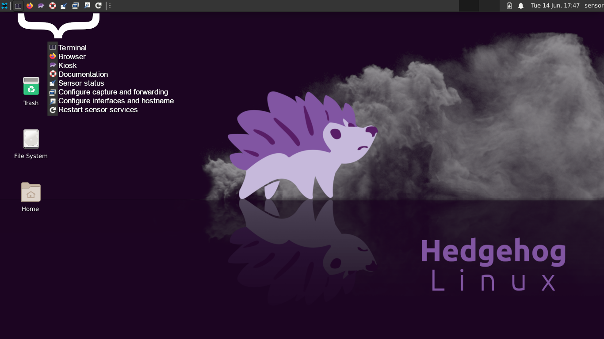
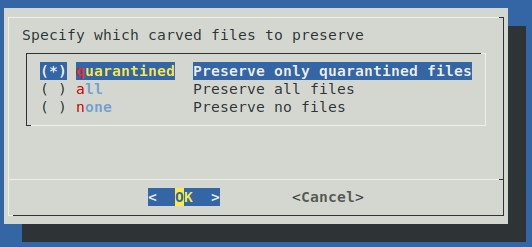
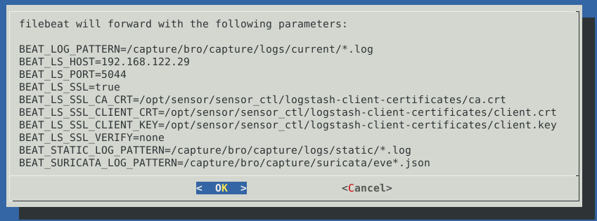
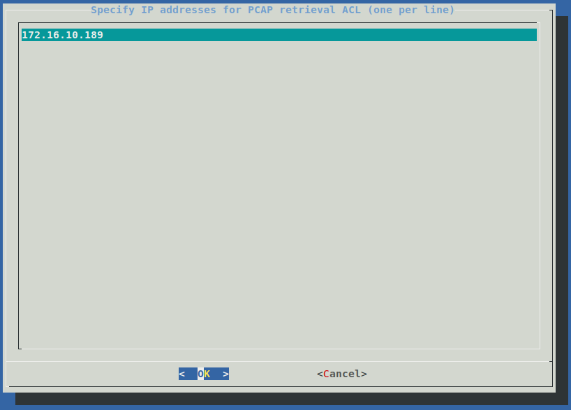
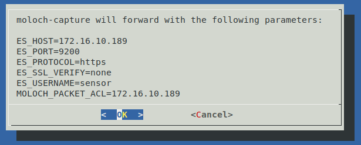
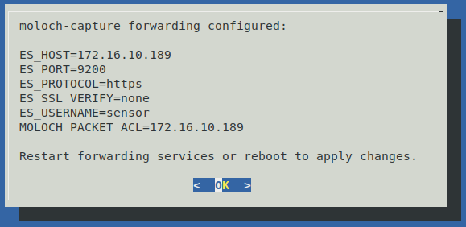

# Hedgehog Linux 
## Network Traffic Capture Appliance


### <a name="TableOfContents"></a>Table of Contents

* [Sensor installation](#Installation)
    - [Image boot options](#BootOptions)
    - [Installer](#Installer)
* [Boot](#Boot)
    - [Kiosk mode](#KioskMode)
* [Configuration](#Configuration)
    - [Interfaces, hostname, and time synchronization](#ConfigRoot)
        + [Hostname](#ConfigHostname)
        + [Interfaces](#ConfigIface)
        + [Time synchronization](#ConfigTime)
    - [Capture, forwarding, and autostart services](#ConfigRoot)
        + [Capture](#ConfigCapture)
            * [Automatic file extraction and scanning](#ZeekFileExtraction)
        + [Forwarding](#ConfigForwarding)
            * [filebeat](#filebeat): Zeek log forwarding
            * [moloch-capture](#moloch-capture): Moloch session forwarding
            * [metricbeat](#metricbeat): resource statistics forwarding
            * [auditbeat](#auditbeat): audit log forwarding
            * [filebeat-syslog](#syslogbeat): syslog forwarding
            * [heatbeat](#heatbeat): temperature forwarding
        + [Autostart services](#ConfigAutostart)
* [Appendix A - Generating the ISO](#ISOBuild)
* [Appendix B - Configuring SSH access](#ConfigSSH)
* [Appendix C - Troubleshooting](#Troubleshooting)
* [Appendix D - Hardening](#Hardening)
    - [STIG compliance exceptions](#STIGExceptions)
    - [CIS benchmark compliance exceptions](#CISExceptions)
* [Appendix E - Notes](#MiscNotes)
* [Copyright](#Footer)

# <a name="Installation"></a>Sensor installation

## <a name="BootOptions"></a>Image boot options

The Hedgehog Linux installation image, when provided on an optical disc, USB thumb drive, or other removable medium, can be used to install or reinstall the sensor software.


The boot menu of the sensor installer image provides several options:

* **Live system** and **Live system (fully in RAM)** may also be used to run the sensor in a "live USB" mode without installing any software or making any persistent configuration changes on the sensor hardware.
* **Install Hedgehog Linux** and **Install Hedgehog Linux (encrypted)** are used to [install the sensor](#Installer) onto the current system. Both selections install the same operating system and sensor software, the only difference being that the **encrypted** option encrypts the hard disks with a password (provided in a subsequent step during installation) that must be provided each time the sensor boots. There is some CPU overhead involved in an encrypted installation, so it is recommended that encrypted installations only be used for mobile installations (eg., on a sensor that may be shipped or carried for an incident response) and that the unencrypted option be used for fixed sensors in secure environments.
* **Install Hedgehog Linux (advanced configuration)** allows you to configure installation fully using all of the [Debian installer](https://www.debian.org/releases/stable/amd64/) settings and should only be selected for advanced users who know what they're doing.
* **Rescue system** is included for debugging and/or system recovery and should not be needed in most cases.

## <a name="Installer"></a>Installer

The sensor installer is designed to require as little user input as possible. For this reason, there are NO user prompts and confirmations about partitioning and reformatting hard disks for use by the sensor. The  installer assumes that all non-removable storage media (eg., SSD, HDD, NVMe, etc.) are available for use and ⛔🆘😭💀 ***will partition and format them without warning*** 💀😭🆘⛔.

The installer will ask for a few pieces of information prior to installing the sensor operating system:

* **Root password** – a password for the privileged root account which is rarely needed (only during the configuration of the sensors network interfaces and setting the sensor host name)
* **User password** – a password for the non-privileged sensor account under which the various sensor capture and forwarding services run
* **Encryption password** (optional) – if the encrypted installation option was selected at boot time, the encryption password must be entered every time the sensor boots

Each of these passwords must be entered twice to ensure they were entered correctly.



After the passwords have been entered, the installer will proceed to format the system drive and install Hedgehog Linux.


At the end of the installation process, you will be prompted with a few self-explanatory yes/no questions:

* **Disable IPv6?**
* **Automatically login to the GUI session?**
* **Should the GUI session be locked due to inactivity?**
* **Display the [Standard Mandatory DoD Notice and Consent Banner](https://www.stigviewer.com/stig/application_security_and_development/2018-12-24/finding/V-69349)?** *(only applies when installed on U.S. government information systems)*

Following these prompts, the installer will reboot and Hedgehog Linux will boot.

# <a name="Boot"></a>Boot

Each time the sensor boots, a grub boot menu will be shown briefly, after which the sensor will proceed to load.

## <a name="KioskMode"></a>Kiosk mode



The sensor automatically logs in as the sensor user account and runs in **kiosk mode**, which is intended to show an at-a-glance view of the its resource utilization. Clicking the **☰** icon in allows you to switch between the resource statistics view and the services view.



The kiosk's services screen (designed with large clickable labels for small portable touch screens) can be used to start and stop essential services, get a status report of the currently running services, and clean all captured data from the sensor.




# <a name="Configuration"></a>Configuration

Kiosk mode can be exited by connecting an external USB keyboard and pressing **Alt+F4**, upon which the *sensor* user's desktop is shown.



Several icons are available in the top menu bar:

* **Terminal** - opens a command prompt in a terminal emulator
* **Browser** - opens a web browser
* **Kiosk** – returns the sensor to kiosk mode
* **README** – displays this document
* **Sensor status** – displays a list with the status of each sensor service
* **Configure capture and forwarding** – opens a dialog for configuring the sensor's capture and forwarding services, as well as specifying which services should autostart upon boot
* **Configure interfaces and hostname** – opens a dialog for configuring the sensor's network interfaces and setting the sensor's hostname
* **Restart sensor services** - stops and restarts all of the [autostart services](#ConfigAutostart)

## <a name="ConfigRoot"></a>Interfaces, hostname, and time synchronization

### <a name="ConfigHostname"></a>Hostname

The first step of sensor configuration is to configure the network interfaces and sensor hostname. Double-clicking the **Configure Interfaces and Hostname** desktop icon (or, if you are at a command line prompt, running `configure-interfaces`) will prompt you for the root password you created during installation, after which the configuration welcome screen is shown. Select **Continue** to proceed.

You may next select whether to configure the network interfaces, hostname, or time synchronization.


Selecting **Hostname**, you will be presented with a summary of the current sensor identification information, after which you may specify a new sensor hostname.  This name will be used to tag all events forwarded from this sensor in the events' **host.name** field.


### <a name="ConfigIface"></a>Interfaces

Returning to the configuration mode selection, choose **Interface**. You will be prompted if you would like help identifying network interfaces. If you select **Yes**, you will be prompted to select a network interface, after which that interface's link LED will blink for 10 seconds to help you in its identification. This network interface identification aid will continue to prompt you to identify further network interfaces until you select **No**.

You will be presented with a list of interfaces to configure as the sensor management interface. This is the interface the sensor itself will use to communicate with the network in order to, for example, forward captured logs to an aggregate server. In order to do so, the management interface must be assigned an IP address. This is generally **not** the interface used for capturing data. Select the interface to which you wish to assign an IP address. The interfaces are listed by name and MAC address and the associated link speed is also displayed if it can be determined. For interfaces without a connected network cable, generally a `-1` will be displayed instead of the interface speed.


Depending on the configuration of your network, you may now specify how the management interface will be assigned an IP address. In order to communicate with an event aggregator over the management interface, either **static** or **dhcp** must be selected.


If you select static, you will be prompted to enter the IP address, netmask, and gateway to assign to the management interface.


In either case, upon selecting **OK** the network interface will be brought down, configured, and brought back up, and the result of the operation will be displayed. You may choose **Quit** upon returning to the configuration tool’s welcome screen.

### <a name="ConfigTime"></a>Time synchronization

Returning to the configuration mode selection, choose **Time Sync**. Here you can configure the sensor to keep its time synchronized with either an NTP server (using the NTP protocol) or a local [Malcolm](https://github.com/idaholab/malcolm) aggregator or another HTTP/HTTPS server. On the next dialog, choose the time synchronization method you wish to configure.


If **htpdate** is selected, you will be prompted to enter the IP address or hostname and port of an HTTP/HTTPS server (for a Malcolm instance, port `9200` may be used) and the time synchronization check frequency in minutes. A test connection will be made to determine if the time can be retrieved from the server.


If *ntpdate* is selected, you will be prompted to enter the IP address or hostname of the NTP server.


Upon configuring time synchronization, a "Time synchronization configured successfully!" message will be displayed, after which you will be returned to the welcome screen.

## <a name="ConfigRoot"></a>Capture, forwarding, and autostart services

Double-clicking the **Configure Capture and Forwarding** icon (or, if you are at a command prompt, running `configure-capture`) will launch the configuration tool for capture and forwarding. The root password is not required as it was for the interface and hostname configuration, as sensor services are run under the non-privileged sensor account. Select **Continue** to proceed. You may select from a list of configuration options.


### <a name="ConfigCapture"></a>Capture

Choose **Configure Capture** to configure parameters related to traffic capture and local analysis. You will be prompted if you would like help identifying network interfaces. If you select **Yes**, you will be prompted to select a network interface, after which that interface's link LED will blink for 10 seconds to help you in its identification. This network interface identification aid will continue to prompt you to identify further network interfaces until you select **No**.

You will be presented with a list of network interfaces and prompted to select one or more capture interfaces. An interface used to capture traffic is generally a different interface than the one selected previously as the management interface, and each capture interface should be connected to a network tap or span port for traffic monitoring. Capture interfaces are usually not assigned an IP address as they are only used to passively “listen” to the traffic on the wire. The interfaces are listed by name and MAC address and the associated link speed is also displayed if it can be determined. For interfaces without a connected network cable, generally a `-1` will be displayed instead of the interface speed.


Upon choosing the capture interfaces and selecting OK, you may optionally provide a capture filter. This filter will be used to limit what traffic the PCAP service ([`tcpdump`](https://www.tcpdump.org/)) and the traffic analysis service ([`zeek`](https://www.zeek.org/)) will see. Capture filters are specified using [Berkeley Packet Filter (BPF)](http://biot.com/capstats/bpf.html) syntax. Clicking **OK** will attempt to validate the capture filter, if specified, and will present a warning if the filter is invalid.


Next you must specify the paths where captured PCAP files and Zeek logs will be stored locally on the sensor. If the installation worked as expected, these paths should be prepopulated to reflect paths on the volumes formatted at install time for the purpose storing these artifacts. Usually these paths will exist on separate storage volumes. Enabling the PCAP and Zeek log pruning autostart services (see the section on autostart services below) will enable monitoring of these paths to ensure that their contents do not consume more than 90% of their respective volumes’ space. Choose **OK** to continue.


#### <a name="ZeekFileExtraction"></a>Automatic file extraction and scanning

Hedgehog Linux can leverage Zeek's knowledge of network protocols to automatically detect file transfers and extract those files from PCAPs as Zeek processes them.

To specify which files should be extracted, specify the Zeek file carving mode:


If you're not sure what to choose, either of **mapped (except common plain text files)** (if you want to carve and scan almost all files) or **interesting** (if you only want to carve and scan files with [mime types of common attack vectors](./interface/sensor_ctl/extractor_override.interesting.zeek)) is probably a good choice.

Extracted files can be examined through either (but not both) of two methods:

* scanning files with [**ClamAV**](https://www.clamav.net/); to enable this method, enable **AUTOSTART_CLAMAV_SERVICE** when configuring [autostart services](#ConfigAutostart) and leave `VTOT_API2_KEY` value (described below) blank
* submitting file hashes to [**VirusTotal**](https://www.virustotal.com/en/#search); to enable this method manually edit `/opt/sensor/sensor_ctl/control_vars.conf` and specify your [VirusTotal API key](https://developers.virustotal.com/reference) in `VTOT_API2_KEY`

Files which are flagged as potentially malicious via either of these methods will be logged as Zeek `signatures.log` entries, and can be viewed in the **Signatures** dashboard in [Kibana](https://github.com/idaholab/malcolm#KibanaVisualizations) when forwarded to Malcolm.

Next, specify which carved files to preserve (saved on the sensor under `/capture/bro/capture/extract_files/quarantine` by default). In order to not consume all of the sensor's available storage space, the oldest preserved files will be pruned along with the oldest Zeek logs as described below with **AUTOSTART_PRUNE_ZEEK** in the [autostart services](#ConfigAutostart) section.



Finally, you will then be presented with the list of configuration variables that will be used for capture, including the values which you have configured up to this point in this section. Upon choosing **OK** these values will be written back out to the sensor configuration file located at `/opt/sensor/sensor_ctl/control_vars.conf`. It is not recommended that you edit this file manually. After confirming these values, you will be presented with a confirmation that these settings have been written to the configuration file, and you will be returned to the welcome screen.


### <a name="ConfigForwarding"></a>Forwarding

Select **Configure Forwarding** to set up forwarding logs and statistics from the sensor to an aggregator server, such as [Malcolm](https://github.com/idaholab/malcolm) or another [Elastic Stack](https://www.elastic.co/products/)-based server.


There are five forwarder services used on the sensor, each for forwarding a different type of log or sensor metric.

### <a name="filebeat"></a>filebeat: Zeek log forwarding

[Filebeat](https://www.elastic.co/products/beats/filebeat) is used to forward [Zeek](https://www.zeek.org/) logs to a remote [Logstash](https://www.elastic.co/products/logstash) instance for further enrichment prior to insertion into an [Elasticsearch](https://www.elastic.co/products/elasticsearch) database.

To configure filebeat, first provide the log path (the same path previously configured for Zeek log file generation). You must also provide the IP address of the Logstash instance to which the logs are to be forwarded, and the port on which Logstash is listening. These logs are forwarded using the Beats protocol, generally over port 5044. Depending on your network configuration, you may need to open this port in your firewall to allow this connection from the sensor to the aggregator.


Next you are asked whether the connection used for Zeek log forwarding should be done **unencrypted** or over **SSL**. Unencrypted communication requires less processing overhead and is simpler to configure, but the contents of the logs may be visible to anyone who is able to intercept that traffic.


If **SSL** is chosen, you must choose whether to enable [SSL certificate verification](https://www.elastic.co/guide/en/beats/filebeat/current/configuring-ssl-logstash.html). If you are using a self-signed certificate (such as the one automatically created during [Malcolm's configuration](https://github.com/idaholab/malcolm#configure-authentication), choose **None**.


The last step for SSL-encrypted Zeek log forwarding is to specify the SSL certificate authority, certificate, and key files. These files must match those used by the Logstash instance receiving the Zeek logs on the aggregator. If Malcolm's `auth_setup.sh` script was used to generate these files they would be found in the `filebeat/certs/` subdirectory of the Malcolm installation and must be manually copied to the sensor (stored under `/opt/sensor/sensor_ctl/filebeat/` or in any other path accessible to the sensor account). Specify the location of the certificate authorities file (eg., `ca.crt`), the certificate file (eg., `client.crt`), and the key file (eg., `client.key`).


The Logstash instance receiving the events must be similarly configured with matching SSL certificate and key files. Under Malcolm, the `BEATS_SSL` variable must be set to true in Malcolm's `docker-compose.yml` file and the SSL files must exist in the `logstash/certs/` subdirectory of the Malcolm installation.

Once you have specified all of the filebeat parameters, you will be presented with a summary of the settings related to the forwarding of these logs. Selecting **OK** will cause the parameters to be written to filebeat’s configuration keystore under `/opt/sensor/sensor_ctl/filebeat` and you will be returned to the configuration tool’s welcome screen.



### <a name="moloch-capture"></a>moloch-capture: Moloch session forwarding

[moloch-capture](https://github.com/aol/moloch/tree/master/capture) is not only used to capture PCAP files, but also the parse raw traffic into sessions and forward this session metadata to an [Elasticsearch](https://www.elastic.co/products/elasticsearch) database so that it can be viewed in [Moloch viewer](https://molo.ch/), whether standalone or as part of a [Malcolm](https://github.com/idaholab/malcolm) instance. If you're using Hedgehog Linux with Malcolm, please read [Correlating Zeek logs and Moloch sessions](https://github.com/idaholab/malcolm#ZeekMolochFlowCorrelation) in the Malcolm documentation for more information.

First, select the Elasticsearch connection transport protocol, either **HTTPS** or **HTTP**. If the metrics are being forwarded to Malcolm, select **HTTPS** to encrypt messages from the sensor to the aggregator using TLS v1.2 using ECDHE-RSA-AES128-GCM-SHA256. If **HTTPS** is chosen, you must choose whether to enable SSL certificate verification. If you are using a self-signed certificate (such as the one automatically created during [Malcolm's configuration](https://github.com/idaholab/malcolm#configure-authentication)), choose **None**.

 

Next, enter the **Elasticsearch host** IP address (ie., the IP address of the aggregator) and port. These metrics are written to an Elasticsearch database using a RESTful API, usually using port 9200. Depending on your network configuration, you may need to open this port in your firewall to allow this connection from the sensor to the aggregator.


You will be asked to enter authentication credentials for the sensor’s connections to the aggregator’s Elasticsearch API. After you’ve entered the username and the password, the sensor will attempt a test connection to Elasticsearch using the connection information provided.

  

Finally, you will be shown a dialog for a list of IP addresses used to populate an access control list (ACL) for hosts allowed to connect back to the sensor for retrieving session payloads from its PCAP files for display in Moloch viewer. The list will be prepopulated with the IP address entered a few screens prior to this one.



Finally, you’ll be given the opportunity to review the all of the moloch-capture forwrading options you’ve specified. Selecting **OK** will cause the parameters to be saved and you will be returned to the configuration tool’s welcome screen.

 

### <a name="metricbeat"></a>metricbeat: resource statistics forwarding

The sensor uses [metricbeat](https://www.elastic.co/products/beats/metricbeat) to forward system resource metrics (CPU, network I/O, disk I/O, memory utilization, etc.) to an Elasticsearch database using a RESTful API using HTTP/HTTPS as the transport protocol. Select **metricbeat** from the forwarding configuration mode options.

Metricbeat gathers system resource metrics at an interval you specify. The default interval is 30 seconds, but it can be set to any value between 1 and 60 seconds.


Next, select the Elasticsearch connection transport protocol, either **HTTPS** or **HTTP**. If the metrics are being forwarded to Malcolm, select **HTTPS** to encrypt messages from the sensor to the aggregator using TLS v1.2 using ECDHE-RSA-AES128-GCM-SHA256. If **HTTPS** is chosen, you must choose whether to enable SSL certificate verification. If you are using a self-signed certificate (such as the one automatically created during [Malcolm's configuration](https://github.com/idaholab/malcolm#configure-authentication), choose **None**.

 

Next, enter the **Elasticsearch host** IP address (ie., the IP address of the aggregator) and port. These metrics are written to an Elasticsearch database using a RESTful API, usually using port 9200. Depending on your network configuration, you may need to open this port in your firewall to allow this connection from the sensor to the aggregator.


Next, you will be asked if you wish to configure **Kibana** connectivity. [Kibana](https://www.elastic.co/products/kibana) is the Elastic Stack’s data visualization tool. If you choose **Yes** and proceed to configure Kibana connectivity, metricbeat will create custom search indexes, visualizations, and dashboards for Kibana to display the sensor’s resource metrics.

You will be prompted to specify the **connection protocol** and (for HTTPS) **SSL verification** for Kibana. These values should probably be the same ones you chose for Elasticsearch. You will also be prompted for the **Kibana host** IP address and **port**. The IP address will probably be the same one you specified for Elasticsearch. The default Kibana port is 5601.

The final settings required to configure Kibana are whether or not to configure **Kibana dashboards** and the local directory on the sensor containing the dashboards to be imported. The default values are probably what you want.

Finally, you will be asked to enter authentication credentials for the sensor’s connections to the aggregator’s Elasticsearch and Kibana APIs.

After you’ve entered the username and the password, the sensor will attempt test connections to the Elasticsearch and Kibana APIs using the connection information provided.

   

Finally, you’ll be given the opportunity to review the all of the metricbeat options you’ve specified. Selecting **OK** will cause the parameters to be written to metricbeat’s configuration keystore under `/opt/sensor/sensor_ctl/metricbeat` and you will be returned to the configuration tool’s welcome screen.

 

### <a name="auditbeat"></a>auditbeat: audit log forwarding

The sensor uses [auditbeat](https://www.elastic.co/products/beats/auditbeat) to forward auditd logs, process and socket statistics, and sensor system file integrity information to an Elasticsearch database. Its configuration is almost identical to that of metricbeat in the previous section. Select **auditbeat** from the forwarding configuration mode options and follow the same steps outlined above to set up this forwarder.

The sensor implements STIG (Security Technical Implementation Guidelines) rules according to DISA RHEL 7 STIG V1 R1, ported to a Debian 9 base platform. Enabling audit log forwarding via auditbeat is required to satisfy the requirements regarding forwarding audit logs to a remote log server as defined in that specification.

### <a name="syslogbeat"></a>filebeat-syslog: syslog forwarding

The sensor uses [filebeat’s syslog input](https://www.elastic.co/guide/en/beats/filebeat/master/filebeat-input-syslog.html) to forward the sensor’s system logs to an Elasticsearch database. Its configuration is almost identical to that of metricbeat in a previous section. Select **filebeat-syslog** from the forwarding configuration mode options and follow the same steps outlined above to set up this forwarder.

Enabling syslog forwarding via filebeat is required to satisfy the STIG requirements regarding sending system logs to a remote log server as defined in that specification.

### <a name="heatbeat"></a>heatbeat: temperature forwarding

The sensor employs a custom agent using the beats protocol to forward hardware metrics such as CPU and storage device temperatures, system voltages, and fan speeds (when applicable) to an Elasticsearch database. Its configuration is almost identical to that of metricbeat in a previous section. Select **heatbeat** from the forwarding configuration mode options and follow the same steps outlined above to set up this forwarder.

### <a name="ConfigAutostart"></a>Autostart services

Once the forwarders have been configured, the final step is to **Configure Autostart Services**. Choose this option from the configuration mode menu after the welcome screen of the sensor configuration tool.

Despite configuring capture and/or forwarder services as described in previous sections, only services enabled in the autostart configuration will run when the sensor starts up. The available autostart processes are as follows (recommended services are in **bold text**):

* **AUTOSTART_AUDITBEAT** – [auditbeat](#auditbeat) audit log forwarder
* **AUTOSTART_CLAMAV_SERVICE** – ClamAV service for scanning [files carved from traffic streams by Zeek](#ZeekFileExtraction) for trojans, viruses, malware and other malicious threats
* **AUTOSTART_CLAMAV_UPDATES** – Virus database update service for ClamAV (requires sensor to be connected to the internet)
* **AUTOSTART_FILEBEAT** – [filebeat](#filebeat) Zeek log forwarder 
* **AUTOSTART_HEATBEAT** – [sensor hardware](#heatbeat) (eg., CPU and storage device temperature) metrics forwarder
* **AUTOSTART_HEATBEAT_SENSORS** – the background process monitoring [hardware sensors](#heatbeat) for temperatures, voltages, fan speeds, etc. (this is required in addition to **AUTOSTART_HEATBEAT** metrics forwarding)
* **AUTOSTART_METRICBEAT** – system resource utilization [metrics forwarder](#metricbeat)
* **AUTOSTART_MOLOCH** – [moloch-capture](##moloch-capture) PCAP engine for traffic capture, as well as traffic parsing and metadata insertion into Elasticsearch for viewing in [Moloch](https://molo.ch/). If you are using Hedgehog Linux along with [Malcolm](https://github.com/idaholab/malcolm) or another Moloch installation, this is probably the packet capture engine you want to use.
* *AUTOSTART_NETSNIFF* – [netsniff-ng](http://netsniff-ng.org/) PCAP engine for saving packet capture (PCAP) files
* **AUTOSTART_PRUNE_ZEEK** – storage space monitor to ensure that Zeek logs do not consume more than 90% of the total size of the storage volume to which Zeek logs are written
* **AUTOSTART_PRUNE_PCAP** – storage space monitor to ensure that PCAP files do not consume more than 90% of the total size of the storage volume to which PCAP files are written
* **AUTOSTART_SYSLOGBEAT** – filebeat [system log forwarder](#syslogbeat)
* *AUTOSTART_TCPDUMP* – [tcpdump](https://www.tcpdump.org/) PCAP engine for saving packet capture (PCAP) files
* **AUTOSTART_ZEEK** – [Zeek](https://www.zeek.org/) traffic analysis engine
* **AUTOSTART_ZEEK_FILE_WATCH** – monitor for [files carved from traffic streams by Zeek](#ZeekFileExtraction)

Note that only one packet capture engine ([moloch-capture](https://molo.ch/), [netsniff-ng](http://netsniff-ng.org/), or [tcpdump](https://www.tcpdump.org/)) can be used.


Once you have selected the autostart services, you will be prompted to confirm your selections. Doing so will cause these values to be written back out to the `/opt/sensor/sensor_ctl/control_vars.conf` configuration file.


After you have completed configuring the sensor it is recommended that you reboot the sensor to ensure all new settings take effect. If rebooting is not an option, you may click the **Restart Sensor Services** menu icon in the top menu bar, or open a terminal and run:

```
/opt/sensor/sensor_ctl/shutdown && sleep 10 && /opt/sensor/sensor_ctl/supervisor.sh
```

This will cause the sensor services controller to stop, wait a few seconds, and restart. You can check the status of the sensor’s processes by choosing **Sensor Status** from the sensor’s kiosk mode, double-clicking the **Sensor Service Status** desktop icon, or running `/opt/sensor/sensor_ctl/status` from the command line:

```
$ /opt/sensor/sensor_ctl/status 
beats:auditbeat                  RUNNING   pid 14470, uptime 8 days, 20:22:32
beats:filebeat                   RUNNING   pid 14460, uptime 8 days, 20:22:32
beats:heatbeat                   RUNNING   pid 14481, uptime 8 days, 20:22:32
beats:metricbeat                 RUNNING   pid 14476, uptime 8 days, 20:22:32
beats:sensors                    RUNNING   pid 14484, uptime 8 days, 20:22:32
beats:syslogbeat                 RUNNING   pid 14471, uptime 8 days, 20:22:32
clamav:clamav-service            RUNNING   pid 14454, uptime 8 days, 20:22:32
clamav:clamav-updates            RUNNING   pid 14450, uptime 8 days, 20:22:32
moloch:moloch-capture            RUNNING   pid 14432, uptime 8 days, 20:22:32
moloch:moloch-viewer             RUNNING   pid 14431, uptime 8 days, 20:22:32
netsniff:netsniff-enp8s0         STOPPED   Not started
prune:prune-pcap                 RUNNING   pid 14446, uptime 8 days, 20:22:32
prune:prune-zeek                 RUNNING   pid 14442, uptime 8 days, 20:22:32
tcpdump:tcpdump-enp8s0           STOPPED   Not started
zeek:logger                      RUNNING   pid 14434, uptime 8 days, 20:22:32
zeek:scanner                     RUNNING   pid 14435, uptime 8 days, 20:22:32
zeek:watcher                     RUNNING   pid 14441, uptime 8 days, 20:22:32
zeek:zeekctl                     RUNNING   pid 14433, uptime 8 days, 20:22:32
```

# <a name="ISOBuild"></a>Appendix A - Generating the ISO

Official downloads of the Hedgehog Linux installer ISO are not provided: however, it can be built easily on an internet-connected Linux host running current versions of [VirtualBox](https://www.virtualbox.org/) and [Vagrant](https://www.vagrantup.com/).

To perform a clean build the Hedgehog Linux installer ISO, navigate to your local [Malcolm](https://github.com/idaholab/Malcolm/) working copy and run:

```
$ ./sensor-iso/build_via_vagrant.sh -f
…
Starting build machine...
Bringing machine 'default' up with 'virtualbox' provider...
…
```

Building the ISO may take 90 minutes or more depending on your system. As the build finishes, you will see the following message indicating success:

```
…
Finished, created "/sensor-build/hedgehog-1.8.0.iso"
…
```

# <a name="ConfigSSH"></a>Appendix B - Configuring SSH access

SSH access to the sensor’s non-privileged sensor account is only available using secure key-based authentication which can be enabled by adding a public SSH key to the **/home/sensor/.ssh/authorized_keys** file as illustrated below:

```
sensor@sensor:~$ mkdir -p ~/.ssh

sensor@sensor:~$ ssh analyst@172.16.10.48 "cat ~/.ssh/id_rsa.pub" >> ~/.ssh/authorized_keys
The authenticity of host '172.16.10.48 (172.16.10.48)' can't be established.
ECDSA key fingerprint is SHA256:...
Are you sure you want to continue connecting (yes/no)? yes
Warning: Permanently added '172.16.10.48' (ECDSA) to the list of known hosts.
analyst@172.16.10.48's password:

sensor@sensor:~$ cat ~/.ssh/authorized_keys
ssh-rsa AAA...kff analyst@SOC
```

SSH access should only be configured when necessary.

# <a name="Troubleshooting"></a>Appendix C - Troubleshooting

Should the sensor not function as expected, first try rebooting the device. If the behavior continues, here are a few things that may help you diagnose the problem (items which may require Linux command line use are marked with **†**)

* Stop / start services – Using the sensor’s kiosk mode, attempt a **Services Stop** followed by a **Services Start**, then check **Sensor Status** to see which service(s) may not be running correctly.
* Sensor configuration file – See `/opt/sensor/sensor_ctl/control_vars.conf` for sensor service settings. It is not recommended to manually edit this file unless you are sure of what you are doing.
* Sensor control scripts – There are scripts under ``/opt/sensor/sensor_ctl/`` to control sensor services (eg., `shutdown`, `start`, `status`, `stop`, etc.)
* Sensor debug logs – Log files under `/opt/sensor/sensor_ctl/log/` may contain clues to processes that are not working correctly. If you can determine which service is failing, you can attempt to reconfigure it using the instructions in the Configure Capture and Forwarding section of this document.
* `sensorwatch` script – Running `sensorwatch` on the command line will display the most recently modified PCAP and Zeek log files in their respective directories, how much storage space they are consuming, and the amount of used/free space on the volumes containing those files.

# <a name="Hardening"></a>Appendix D - Hardening

Hedgehog Linux targets the following guidelines for establishing a secure configuration posture:

* DISA STIG (Security Technical Implementation Guides) [ported](https://github.com/hardenedlinux/STIG-4-Debian) from [DISA RHEL 7 STIG](https://www.stigviewer.com/stig/red_hat_enterprise_linux_7/) v1r1 to a Debian 9 base platform
* [CIS Debian Linux 9 Benchmark](https://www.cisecurity.org/cis-benchmarks/cis-benchmarks-faq/) with additional recommendations by the [hardenedlinux/harbian-audit](https://github.com/hardenedlinux/harbian-audit) project

## <a name="STIGExceptions"></a>STIG compliance exceptions

[Currently](https://github.com/hardenedlinux/STIG-4-Debian/blob/master/stig-debian.txt) there are 158 compliance checks that can be verified automatically and 23 compliance checks that must be verified manually.

Hedgehog Linux claims the following exceptions to STIG compliance:

| # | ID  | Title | Justification |
| --- | --- | --- | --- |
| 1 | [SV-86535r1](https://www.stigviewer.com/stig/red_hat_enterprise_linux_7/2017-12-14/finding/V-71911) | When passwords are changed a minimum of eight of the total number of characters must be changed. | Account/password policy exception: As a sensor running Hedgehog Linux is intended to be used as an appliance rather than a general user-facing software platform, some exceptions to password enforcement policies are claimed. |
| 2 | [SV-86537r1](https://www.stigviewer.com/stig/red_hat_enterprise_linux_7/2017-12-14/finding/V-71913) | When passwords are changed a minimum of four character classes must be changed. | Account/password policy exception |
| 3 | [SV-86549r1](https://www.stigviewer.com/stig/red_hat_enterprise_linux_7/2017-07-08/finding/V-71925) | Passwords for new users must be restricted to a 24 hours/1 day minimum lifetime. | Account/password policy exception |
| 4 | [SV-86551r1](https://www.stigviewer.com/stig/red_hat_enterprise_linux_7/2017-07-08/finding/V-71927) | Passwords must be restricted to a 24 hours/1 day minimum lifetime. | Account/password policy exception |
| 5 | [SV-86553r1](https://www.stigviewer.com/stig/red_hat_enterprise_linux_7/2017-12-14/finding/V-71929) | Passwords for new users must be restricted to a 60-day maximum lifetime. | Account/password policy exception |
| 6 | [SV-86555r1](https://www.stigviewer.com/stig/red_hat_enterprise_linux_7/2017-12-14/finding/V-71931) | Existing passwords must be restricted to a 60-day maximum lifetime. | Account/password policy exception |
| 7 | [SV-86557r1](https://www.stigviewer.com/stig/red_hat_enterprise_linux_7/2017-07-08/finding/V-71933) | Passwords must be prohibited from reuse for a minimum of five generations. | Account/password policy exception |
| 8 | [SV-86565r1](https://www.stigviewer.com/stig/red_hat_enterprise_linux_7/2017-07-08/finding/V-71941) | The operating system must disable account identifiers (individuals, groups, roles, and devices) if the password expires. | Account/password policy exception |
| 9 | [SV-86567r2](https://www.stigviewer.com/stig/red_hat_enterprise_linux_7/2017-12-14/finding/V-71943) | Accounts subject to three unsuccessful logon attempts within 15 minutes must be locked for the maximum configurable period. | Account/password policy exception |
| 10 | [SV-86569r1](https://www.stigviewer.com/stig/red_hat_enterprise_linux_7/2017-07-08/finding/V-71945) | If three unsuccessful root logon attempts within 15 minutes occur the associated account must be locked. | Account/password policy exception |
| 11 | [SV-86603r1](https://www.stigviewer.com/stig/red_hat_enterprise_linux_7/2018-11-28/finding/V-71979) | The … operating system must prevent the installation of software, patches, service packs, device drivers, or operating system components of local packages without verification they have been digitally signed using a certificate that is issued by a Certificate Authority (CA) that is recognized and approved by the organization. | As the base distribution is not using embedded signatures, `debsig-verify` would reject all packages (see comment in `/etc/dpkg/dpkg.cfg`). Enabling it after installation would disallow any future updates. |
| 12 | [SV-86607r1](https://www.stigviewer.com/stig/red_hat_enterprise_linux_7/2017-07-08/finding/V-71983) | USB mass storage must be disabled. | The ability to copy data captured by the sensor to a mounted USB mass storage device is a requirement of the system. |
| 13 | [SV-86609r1](https://www.stigviewer.com/stig/red_hat_enterprise_linux_7/2017-07-08/finding/V-71985) | File system automounter must be disabled unless required. | The ability to copy data captured by the sensor to a mounted USB mass storage device is a requirement of the system. |
| 14 | [SV-86705r1](https://www.stigviewer.com/stig/red_hat_enterprise_linux_7/2017-12-14/finding/V-72081) | The operating system must shut down upon audit processing failure, unless availability is an overriding concern. If availability is a concern, the system must alert the designated staff (System Administrator [SA] and Information System Security Officer [ISSO] at a minimum) in the event of an audit processing failure. | As maximizing availability is a system requirement, audit processing failures will be logged on the device rather than halting the system. |
| 15 | [SV-86713r1](https://www.stigviewer.com/stig/red_hat_enterprise_linux_7/2017-12-14/finding/V-72089) | The operating system must immediately notify the System Administrator (SA) and Information System Security Officer ISSO (at a minimum) when allocated audit record storage volume reaches 75% of the repository maximum audit record storage capacity. | As a sensor running Hedgehog Linux is intended to be used as an appliance rather than a general network host, notifications of this sort are sent in system logs forwarded to the Elasticsearch database on the aggregator. `auditd` is set up to syslog when this storage volume is reached. |
| 16 | [SV-86715r1](https://www.stigviewer.com/stig/red_hat_enterprise_linux_7/2017-07-08/finding/V-72093) | The operating system must immediately notify the System Administrator (SA) and Information System Security Officer (ISSO) (at a minimum) when the threshold for the repository maximum audit record storage capacity is reached. | As a sensor running Hedgehog Linux is intended to be used as an appliance rather than a general network host, notifications of this sort are sent in system logs forwarded to the Elasticsearch database on the aggregator. `auditd` is set up to syslog when this storage volume is reached. |
| 17 | [SV-86837r1](https://www.stigviewer.com/stig/red_hat_enterprise_linux_6/2016-12-16/finding/V-38666) | The system must use and update a DoD-approved virus scan program. | As this is a network traffic capture appliance rather than an end-user device and will not be internet-connected, regular user files will not be created. A virus scan program would impact device performance and would be unnecessary. |
| 18 | [SV-86839r1](https://www.stigviewer.com/stig/red_hat_enterprise_linux_7/2017-12-14/finding/V-72215) | The system must update the virus scan program every seven days or more frequently. | As this is a network traffic capture appliance rather than an end-user device and will not be internet-connected, regular user files will not be created. A virus scan program would impact device performance and would be unnecessary. |
| 19 | [SV-86847r2](https://www.stigviewer.com/stig/red_hat_enterprise_linux_7/2017-12-14/finding/V-72223) | All network connections associated with a communication session must be terminated at the end of the session or after 10 minutes of inactivity from the user at a command prompt, except to fulfill documented and validated mission requirements. | The sensor may be controlled from the command line in a manual capture scenario, so timing out a session based on command prompt inactivity would be inadvisable. | 
| 20 | [SV-86893r2](https://www.stigviewer.com/stig/red_hat_enterprise_linux_7/2017-12-14/finding/V-72269) | The operating system must, for networked systems, synchronize clocks with a server that is synchronized to one of the redundant United States Naval Observatory (USNO) time servers, a time server designated for the appropriate DoD network (NIPRNet/SIPRNet), and/or the Global Positioning System (GPS). | While [time synchronization](#ConfigTime) is supported on Hedgehog Linux, an exception is claimed for this rule as the network sensor device may be configured to sync to servers other than the ones listed in the STIG. |
| 21 | [SV-86905r1](https://www.stigviewer.com/stig/red_hat_enterprise_linux_7/2017-12-14/finding/V-72281) | For systems using DNS resolution, at least two name servers must be configured. | STIG recommendations for DNS servers are not enforced on Hedgehog Linux to allow for use in a variety of network scenarios. |
| 22 | [SV-86919r1](https://www.stigviewer.com/stig/red_hat_enterprise_linux_7/2017-07-08/finding/V-72295) | Network interfaces must not be in promiscuous mode. | The purpose of Hedgehog Linux is to sniff and capture network traffic. |
| 23 | [SV-86931r2](https://www.stigviewer.com/stig/red_hat_enterprise_linux_7/2017-12-14/finding/V-72307) | An X Windows display manager must not be installed unless approved. | A locked-down X Windows session is required for the sensor's kiosk display. |
| 24 | [SV-86519r3](https://www.stigviewer.com/stig/red_hat_enterprise_linux_7/2017-07-08/finding/V-71895) | The operating system must set the idle delay setting for all connection types. | As this is a network traffic capture appliance rather than an end-user device, timing out displays or connections would not be desireable. |
| 25 | [SV-86523r1](https://www.stigviewer.com/stig/red_hat_enterprise_linux_7/2017-07-08/finding/V-71899) | The operating system must initiate a session lock for the screensaver after a period of inactivity for graphical user interfaces. | This option is configurable during install time. Some installations of Hedgehog Linux may be on appliance hardware not equipped with a keyboard by default, in which case it may not be desirable to lock the session.|
| 26 | [SV-86525r1](https://www.stigviewer.com/stig/red_hat_enterprise_linux_7/2017-07-08/finding/V-71901) | The operating system must initiate a session lock for graphical user interfaces when the screensaver is activated. | This option is configurable during install time. Some installations of Hedgehog Linux may be on appliance hardware not equipped with a keyboard by default, in which case it may not be desirable to lock the session. |
| 27 | [SV-86589r1](https://www.stigviewer.com/stig/red_hat_enterprise_linux_7/2017-12-14/finding/V-71965) | The operating system must uniquely identify and must authenticate organizational users (or processes acting on behalf of organizational users) using multifactor authentication. | As this is a network traffic capture appliance rather than an end-user device or a multiuser network host, this requirement is not applicable. |
| 28 | [SV-86851r2](https://www.stigviewer.com/stig/red_hat_enterprise_linux_7/2017-12-14/finding/V-72227) | The operating system must implement cryptography to protect the integrity of Lightweight Directory Access Protocol (LDAP) authentication communications. | Does not apply as Hedgehog Linux does not use LDAP for authentication. |
| 29 | [SV-86921r2](https://www.stigviewer.com/stig/red_hat_enterprise_linux_7/2017-07-08/finding/V-72297) | The system must be configured to prevent unrestricted mail relaying. | Does not apply as Hedgehog Linux does run a mail server service. |
| 30 | [SV-86929r1](https://www.stigviewer.com/stig/red_hat_enterprise_linux_7/2017-12-14/finding/V-72305) | If the Trivial File Transfer Protocol (TFTP) server is required, the TFTP daemon must be configured to operate in secure mode. | Does not apply as Hedgehog Linux does run a TFTP server. |
| 31 | [SV-86935r3](https://www.stigviewer.com/stig/red_hat_enterprise_linux_7/2017-12-14/finding/V-72311) | The Network File System (NFS) must be configured to use RPCSEC_GSS. | Does not apply as Hedgehog Linux does run an NFS server. |
| 32 | [SV-87041r2](https://www.stigviewer.com/stig/red_hat_enterprise_linux_7/2017-12-14/finding/V-72417) | The operating system must have the required packages for multifactor authentication installed. | As this is a network traffic capture appliance rather than an end-user device or a multiuser network host, this requirement is not applicable. |
| 33 | [SV-87051r2](https://www.stigviewer.com/stig/red_hat_enterprise_linux_7/2017-07-08/finding/V-72427) | The operating system must implement multifactor authentication for access to privileged accounts via pluggable authentication modules (PAM). | As this is a network traffic capture appliance rather than an end-user device or a multiuser network host, this requirement is not applicable. |
| 34 | [SV-87059r2](https://www.stigviewer.com/stig/red_hat_enterprise_linux_7/2017-07-08/finding/V-72435) | The operating system must implement smart card logons for multifactor authentication for access to privileged accounts. | As this is a network traffic capture appliance rather than an end-user device or a multiuser network host, this requirement is not applicable. |
| 35 | [SV-87829r1](https://www.stigviewer.com/stig/red_hat_enterprise_linux_7/2017-07-08/finding/V-73177) | Wireless network adapters must be disabled. | As an appliance intended to capture network traffic in a variety of network environments, wireless adapters may be needed to capture and/or report wireless traffic. |
| 36 | [SV-86699r1](https://www.stigviewer.com/stig/red_hat_enterprise_linux_7/2017-12-14/finding/V-72075) | The system must not allow removable media to be used as the boot loader unless approved. | Hedgehog Linux supports a live boot mode that can be booted from removable media. |

Please review the notes for these additional rules. While not claiming an exception, they may be implemented or checked in a different way than outlined by the RHEL STIG as Hedgehog Linux is not built on RHEL or for other reasons.

| # | ID  | Title | Note |
| --- | --- | --- | --- |
| 1 | [SV-86585r1](https://www.stigviewer.com/stig/red_hat_enterprise_linux_7/2017-07-08/finding/V-71961) | Systems with a Basic Input/Output System (BIOS) must require authentication upon booting into single-user and maintenance modes. | Although the [compliance check script](https://github.com/hardenedlinux/STIG-4-Debian) does not detect it, booting into recovery mode *does* in fact require the root password. |
| 2 | [SV-86587r1](https://www.stigviewer.com/stig/red_hat_enterprise_linux_7/2017-12-14/finding/V-71963) | Systems using Unified Extensible Firmware Interface (UEFI) must require authentication upon booting into single-user and maintenance modes. | Although the [compliance check script](https://github.com/hardenedlinux/STIG-4-Debian) does not detect it, booting into recovery mode *does* in fact require the root password. |
| 3 | [SV-86651r1](https://www.stigviewer.com/stig/red_hat_enterprise_linux_7/2017-12-14/finding/V-72027) | All files and directories contained in local interactive user home directories must have mode 0750 or less permissive. | Depending on when the [compliance check script](https://github.com/hardenedlinux/STIG-4-Debian) is run, some nonessential ephemeral files may exist in the `sensor` home directory which will cause this check to fail. For practical purposes Hedgehog Linux's configuration does, however, comply. This file list can be checked manually by running `find /home/sensor -type f -perm /027 -exec ls -l '{}' ';'`.|
| 4 | [SV-86693r2](https://www.stigviewer.com/stig/red_hat_enterprise_linux_7/2017-12-14/finding/V-72069) | The file integrity tool must be configured to verify Access Control Lists (ACLs). | [Auditbeat](https://www.elastic.co/products/beats/auditbeat) is managing file integrity checks instead of the `aide` specified for use in the RHEL STIG. Additionally, as this is not a multi-user system, the ACL check would be irrelevant. |
| 5 | [SV-86597r1](https://www.stigviewer.com/stig/red_hat_enterprise_linux_7/2017-07-08/finding/V-71973) | A file integrity tool must verify the baseline operating system configuration at least weekly. | [Auditbeat](https://www.elastic.co/products/beats/auditbeat) is managing file integrity checks instead of the `aide` specified for use in the RHEL STIG. |
| 6 | [SV-86697r2](https://www.stigviewer.com/stig/red_hat_enterprise_linux_7/2017-07-08/finding/V-72073) | The file integrity tool must use FIPS 140-2 approved cryptographic hashes for validating file contents and directories. | [Auditbeat](https://www.elastic.co/products/beats/auditbeat) is managing file integrity checks instead of the `aide` specified for use in the RHEL STIG. Auditbeat uses SHA1 which is FIPS 140-2 approved. |
| 7 | [SV-86623r3](https://www.stigviewer.com/stig/red_hat_enterprise_linux_7/2017-12-14/finding/V-71999) | Vendor packaged system security patches and updates must be installed and up to date. | When the Hedgehog Linux sensor appliance software is built, all of the latest applicable security patches and updates are included in it. How future updates are to be handled is still in design. |
| 8 | [SV-86707r1](https://www.stigviewer.com/stig/red_hat_enterprise_linux_7/2017-07-08/finding/V-72083) | The operating system must off-load audit records onto a different system or media from the system being audited. | [Auditbeat](https://www.elastic.co/products/beats/auditbeat) offloads audit records to an Elasticsearch database on another system, though this is not detected by the [compliance check script](https://github.com/hardenedlinux/STIG-4-Debian). |
| 9 | [SV-86709r1](https://www.stigviewer.com/stig/red_hat_enterprise_linux_7/2017-12-14/finding/V-72085) | The operating system must encrypt the transfer of audit records off-loaded onto a different system or media from the system being audited. | [Auditbeat](https://www.elastic.co/products/beats/auditbeat) offloads (via an encrypted channel) audit records to an Elasticsearch database on another system, though this is not detected by the [compliance check script](https://github.com/hardenedlinux/STIG-4-Debian). |
| 10 | [SV-86833r1](https://www.stigviewer.com/stig/red_hat_enterprise_linux_7/2017-07-08/finding/V-72209) | The system must send rsyslog output to a log aggregation server. | Syslogs are forwarded to an Elasticsearch database running on another system via [filebeat](https://www.elastic.co/guide/en/beats/filebeat/current/filebeat-input-syslog.html), though this is not detected by the [compliance check script](https://github.com/hardenedlinux/STIG-4-Debian). |
| 11 | [SV-87815r2](https://www.stigviewer.com/stig/red_hat_enterprise_linux_7/2017-12-14/finding/V-73163) | The audit system must take appropriate action when there is an error sending audit records to a remote system. | [Auditbeat](https://www.elastic.co/products/beats/auditbeat) offloads audit records to an Elasticsearch database on another system, though this is not detected by the [compliance check script](https://github.com/hardenedlinux/STIG-4-Debian). Local logs are generated when this network connection is broken, and it resumes automatically. |
| 12 | [SV-86691r2](https://www.stigviewer.com/stig/red_hat_enterprise_linux_7/2017-07-08/finding/V-72067) | The operating system must implement NIST FIPS-validated cryptography for the following: to provision digital signatures, to generate cryptographic hashes, and to protect data requiring data-at-rest protections in accordance with applicable federal laws, Executive Orders, directives, policies, regulations, and standards. | Hedgehog Linux does use FIPS-compatible libraries for cryptographic functions. However, the kernel parameter being checked by the [compliance check script](https://github.com/hardenedlinux/STIG-4-Debian) is incompatible with some of the systems initialization scripts.|

In addition, DISA STIG rules SV-86663r1, SV-86695r2, SV-86759r3, SV-86761r3, SV-86763r3, SV-86765r3, SV-86595r1, and SV-86615r2 relate to the SELinux kernel which is not used in Hedgehog Linux, and are thus skipped.

## <a name="CISExceptions"></a>CIS benchmark compliance exceptions

[Currently](https://github.com/hardenedlinux/harbian-audit/tree/master/bin/hardening) there are 271 checks to determine compliance with the CIS Debian Linux 9 Benchmark.

Hedgehog Linux claims exceptions from the recommendations in this benchmark in the following categories:

**1.1 Install Updates, Patches and Additional Security Software** - When the Hedgehog Linux sensor appliance software is built, all of the latest applicable security patches and updates are included in it. How future updates are to be handled is still in design.

**1.3 Enable verify the signature of local packages** - As the base distribution is not using embedded signatures, `debsig-verify` would reject all packages (see comment in `/etc/dpkg/dpkg.cfg`). Enabling it after installation would disallow any future updates.

**2.14 Add nodev option to /run/shm Partition**, **2.15 Add nosuid Option to /run/shm Partition**, **2.16 Add noexec Option to /run/shm Partition** - Hedgehog Linux does not mount `/run/shm` as a separate partition, so these recommendations do not apply.

**2.18 Disable Mounting of cramfs Filesystems**, **2.19 Disable Mounting of freevxfs Filesystems**, **2.20 Disable Mounting of jffs2 Filesystems**, **2.21 Disable Mounting of hfs Filesystems**, **2.22 Disable Mounting of hfsplus Filesystems**, **2.23 Disable Mounting of squashfs Filesystems**, **2.24 Disable Mounting of udf Filesystems** - Hedgehog Linux is not compiling a custom Linux kernel, so these filesystems are inherently supported as they are part Debian Linux's default kernel.

**4.6 Disable USB Devices** - The ability to copy data captured by the sensor to a mounted USB mass storage device is a requirement of the system.

**6.1 Ensure the X Window system is not installed**, **6.2 Ensure Avahi Server is not enabled**, **6.3 Ensure print server is not enabled** - A locked-down X Windows session is required for the sensor's kiosk display. The library packages `libavahi-common-data`, `libavahi-common3`, and `libcups2` are dependencies of some of the X components used by Hedgehog Linux, but the `avahi` and `cups` services themselves are disabled.

**6.17 Ensure virus scan Server is enabled**, **6.18 Ensure virus scan Server update is enabled** - As this is a network traffic capture appliance rather than an end-user device and will not be internet-connected, regular user files will not be created. A virus scan program would impact device performance and would be unnecessary.

**7.2.4 Log Suspicious Packets**, **7.2.7 Enable RFC-recommended Source Route Validation**, **7.4.1 Install TCP Wrappers** - As this is a network traffic capture appliance sniffing packets on a network interface configured in promiscuous mode, these recommendations do not apply.

Password-related recommendations under **9.2** and **10.1** - The library package `libpam-pwquality` is used in favor of `libpam-cracklib` which is what the [compliance scripts](https://github.com/hardenedlinux/harbian-audit/tree/master/bin/hardening) are looking for. Also, as a sensor running Hedgehog Linux is intended to be used as an appliance rather than a general user-facing software platform, some exceptions to password enforcement policies are claimed.

**9.3.13 Limit Access via SSH** - Hedgehog Linux does not create multiple regular user accounts: only `root` and a `sensor` service account are used. SSH access for `root` is disabled. SSH login with a password is also disallowed: only key-based authentication is accepted. The `sensor` service account accepts no keys by default. As such, the `AllowUsers`, `AllowGroups`, `DenyUsers`, and `DenyGroups` values in `sshd_config` do not apply.

**9.5 Restrict Access to the su Command** - Hedgehog Linux does not create multiple regular user accounts: only `root` and a `sensor` service account are used.

**10.1.10 Set maxlogins for all accounts** and **10.5 Set Timeout on ttys** - Hedgehog Linux does not create multiple regular user accounts: only `root` and a `sensor` service account are used.

**12.10 Find SUID System Executables**, **12.11 Find SGID System Executables** - The few files found by [these](https://github.com/hardenedlinux/harbian-audit/blob/master/bin/hardening/12.10_find_suid_files.sh) [scripts](https://github.com/hardenedlinux/harbian-audit/blob/master/bin/hardening/12.11_find_sgid_files.sh) are valid exceptions required by Hedgehog Linux's system requirements.

Please review the notes for these additional guidelines. While not claiming an exception, Hedgehog Linux may implement them in a manner different than is described by the [CIS Debian Linux 9 Benchmark](https://www.cisecurity.org/cis-benchmarks/cis-benchmarks-faq/) or the [hardenedlinux/harbian-audit](https://github.com/hardenedlinux/harbian-audit) audit scripts.

**4.1 Restrict Core Dumps** - Hedgehog Linux disables core dumps using a configuration file for `ulimit` named `/etc/security/limits.d/limits.conf`. The [audit script](https://github.com/hardenedlinux/harbian-audit/blob/master/bin/hardening/4.1_restrict_core_dumps.sh) checking for this does not check the `limits.d` subdirectory, which is why this is incorrectly flagged as noncompliant.

**5.4 Ensure ctrl-alt-del is disabled** - Hedgehog Linux disables the `ctrl+alt+delete` key sequence by executing `systemctl disable ctrl-alt-del.target` during installation and the command `systemctl mask ctrl-alt-del.target` at boot time.

**6.19 Configure Network Time Protocol (NTP)** - While [time synchronization](#ConfigTime) is supported on Hedgehog Linux, an exception is claimed for this rule as the network sensor device may be configured to sync to servers in a different way than specified in the benchmark.

**7.4.4 Create /etc/hosts.deny**, **7.7.1 Ensure Firewall is active**, **7.7.4.1 Ensure default deny firewall policy**, **7.7.4.3 Ensure default deny firewall policy**, **7.7.4.4 Ensure outbound and established connections are configured** - Hedgehog Linux **is** configured with an appropriately locked-down software firewall (managed by "Uncomplicated Firewall" `ufw`). However, the methods outlined in the CIS benchmark recommendations do not account for this configuration. 

**8.1.1.2 Disable System on Audit Log Full**, **8.1.1.3 Keep All Auditing Information**, **8.1.1.5 Ensure set remote_server for audit service**, **8.1.1.6 Ensure enable_krb5 set to yes for remote audit service**, **8.1.1.7 Ensure set action for audit storage volume is fulled**, **8.1.1.9 Set space left for auditd service**, a few other audit-related items under section **8.1**, **8.2.5 Configure rsyslog to Send Logs to a Remote Log Host** - As maximizing availability is a system requirement, audit processing failures will be logged on the device rather than halting the system. Because Hedgehog Linux is intended to be used as an appliance rather than a general network host, notifications about its status are sent in system logs forwarded to the Elasticsearch database on the aggregator. `auditd` is set up to syslog when this storage volume is reached. [Auditbeat](https://www.elastic.co/products/beats/auditbeat) offloads audit records to an Elasticsearch database on another system, though this is not detected by the [CIS benchmark compliance scripts](https://github.com/hardenedlinux/harbian-audit/tree/master/bin/hardening). Local logs are generated when the network connection is broken, and it resumes automatically. Syslog messages are also similarly forwarded.

**8.4.1 Install aide package** and **8.4.2 Implement Periodic Execution of File Integrity** - [Auditbeat](https://www.elastic.co/products/beats/auditbeat) is managing file integrity checks instead of the `aide` utility.

**8.7 Verifies integrity all packages** - The [script](https://github.com/hardenedlinux/harbian-audit/blob/master/bin/hardening/8.7_verify_integrity_packages.sh) which verifies package integrity only "fails" because of missing (status `??5??????` displayed by the utility) language ("locale") files, which are removed as part of Hedgehog Linux's trimming-down process. All non-locale-related system files pass intergrity checks.

# <a name="MiscNotes"></a>Appendix E - Notes

If you are interesting in developing your own network traffic capture appliance or would like to know more about the inner-workings of Hedgehog Linux, please read the [Notes](./docs/Notes.md) document that captures some of those details.

# <a name="Footer"></a>Copyright

Hedgehog Linux - part of [Malcolm](https://github.com/idaholab/Malcolm) - is Copyright 2019 Battelle Energy Alliance, LLC, and is developed and released through the cooperation of the Cybersecurity and Infrastructure Security Agency of the U.S. Department of Homeland Security.

See [`License.txt`](https://raw.githubusercontent.com/idaholab/Malcolm/master/License.txt) for the terms of its release.

### Contact information of author(s):

[Seth Grover](mailto:Seth.Grover@inl.gov?subject=Network%20sensor%20development)
